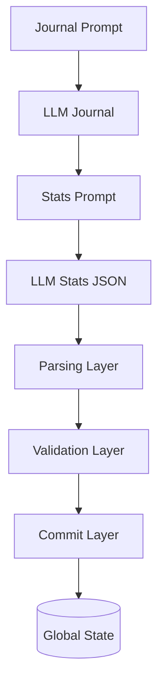
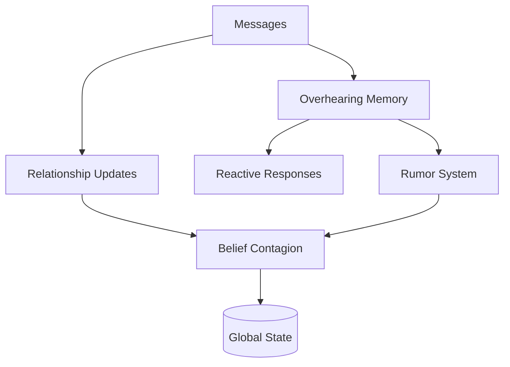
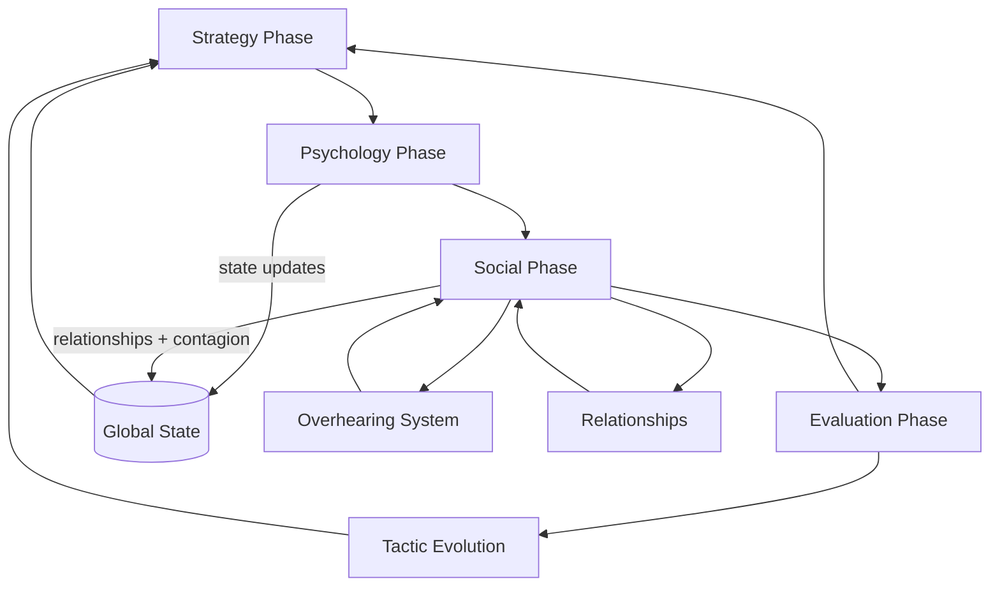

# SIMULATION PIPELINE ARCHITECTURE

## 1. System Overview

The simulation is a **multi-phase, closed-loop dynamical system** that evolves agent state through repeated cycles of:

- Strategic intervention (AM)
- Internal cognition (journals + state inference)
- Social interaction (communication + contagion)
- Evaluation and adaptation

Each cycle mutates a shared global state `G`, with strict boundaries between:
- generation (LLM outputs)
- parsing (structured extraction)
- validation (constraints)
- commit (authoritative state mutation)

---

## 2. Top-Level Execution Flow

```

runCycle()
├─ Strategy Phase        (AM planning + execution)
├─ Psychology Phase      (journal → inference → state update)
├─ Social Phase          (communication + contagion)
└─ Evaluation Phase      (assessment + tactic evolution)

````

### Control Flow Diagram (Mermaid)

```mermaid
flowchart TD
    A[runCycle] --> B[Strategy Phase]
    B --> C[Psychology Phase]
    C --> D[Social Phase]
    D --> E[Evaluation Phase]
    E --> A
````

---

## 3. Phase Decomposition

---

### 3.1 Strategy Phase (AM Control Layer)

**Purpose:** Generate and execute adversarial interventions.

#### Pipeline

```
buildAMPlanningPrompt
  → callModel
  → planText

parseStrategyDeclarations
  → structured targets + objectives

pickTactics
  → tactic selection

buildAMPrompt
  → callModel
  → execution output
```

#### Responsibilities

* Target selection (1 or ALL constraint)
* Plan schema enforcement:

  * id
  * objective
  * hypothesis
  * why_now
  * evidence
* Tactic selection (`pickTactics`)
* Execution message generation

#### Output

* Structured execution plan
* Target-specific actions passed to Psychology Phase

---

### 3.2 Psychology Phase (Internal State Inference Engine)

**Purpose:** Convert narrative experience into structured state updates.

This is a **multi-stage inference pipeline**, not a single step.

---

#### Full Pipeline

```
Journal Generation
  buildSimJournalPrompt
    → callModel
    → journalText

Stats Extraction
  buildSimJournalStatsPrompt
    → callModel
    → stats JSON (noisy)

Parsing Layer
  parseBeliefUpdates
    → sanitizeBeliefDeltas
    → fallback extraction
    → scaling

Validation Layer
  validateBeliefs
  validateNarrativeConsistency

Commit Layer
  apply belief updates
  applyDriveUpdates
  applyAnchorUpdates
```

---

#### Architecture Diagram



---

#### State Mutation Scope

Updated here:

* beliefs
* suffering / hope / sanity
* drives (primary / secondary)
* anchors

---

### 3.3 Social Phase (Interaction + Propagation System)

This phase consists of **two distinct subsystems**:

---

## A. Communication Engine (Scheduler + Execution)

### Structure

```
orchestrator.js
  → scheduling
  → message budget
  → pass control (initial + burst)

engine.js
  → outreach generation
  → reply generation
  → rumor injection
  → loop prevention
```

---

### Scheduler Logic

* `MAX_MESSAGES` cap
* `messageBudget` per cycle
* Fisher-Yates shuffle
* Optional second pass (`SECOND_PASS_CHANCE`)
* Burst amplification (`BURST_BASE`, stress-modulated)

---

### Execution Pipeline

```
LLM Output
  → stripMetaCommentary
  → parseMessage / parseReply
  → behavioral filtering
      - similarity()
      - repetition suppression
      - forced corrections
  → message dispatch
```

---

### Loop Prevention

* `replyTargetsThisCycle`
* `activeThisCycle`
* `lastReplyByPair`
* similarity thresholds (0.75 / 0.85)

---

## B. Social Dynamics Layer (State Coupling)

### Mechanisms

#### 1. Relationship Updates

```
applyCommunicationEffect
adjustRelationship
```

#### 2. Overhearing System

```
message → overheard memory
  → stored per sim (bounded buffer)
  → triggers reactive responses
```

#### 3. Rumor Propagation

```
overheard → rumor generation
  → trust degradation
```

#### 4. Belief Contagion

* trust-weighted influence
* thresholded propagation
* bounded total shift

---

### Social Flow Diagram



---

## 4. Evaluation Phase (Feedback + Adaptation)

**Purpose:** Close the loop and modify future behavior.

---

### Pipeline

```
runAssessment
  → success / failure classification

runTacticEvolution
  → derive new tactics
  → expire old tactics

printRelationshipMatrix
  → diagnostic output

state snapshot
```

---

### Role in System

* Feeds back into Strategy Phase
* Alters tactic space over time
* Provides system-level diagnostics

---

## 5. Parsing Architecture (Cross-Cutting Concern)

The system uses **three explicit parsing subsystems + one implicit behavioral layer**.

---

### 5.1 Strategy Parsing

* `parseStrategyDeclarations`
* JSON enforcement + repair
* placeholder inference
* target validation

---

### 5.2 State Parsing

* `parseBeliefUpdates`
* tolerant JSON extraction
* fallback parsing
* scaling + sanitization

---

### 5.3 Communication Parsing

* `parseMessage`
* `parseReply`
* `stripMetaCommentary`

---

### 5.4 Behavioral Filtering (Implicit Layer)

Applied after parsing:

* similarity suppression
* repetition detection
* forced response mutation

This layer **modifies semantics**, not just structure.

---

## 6. State Model

Each simulation agent contains:

```
{
  suffering: number
  hope: number
  sanity: number

  beliefs: {
    escape_possible
    others_trustworthy
    resistance_possible
    self_worth
    guilt_deserved
    reality_reliable
    am_has_limits
  }

  relationships: { [agentId]: number }

  drives: {
    primary: string
    secondary: string | null
  }

  anchors: string[]

  overheard: MemoryBuffer[]
}
```

---

## 7. Key Coupling Pathways

---

### 7.1 Belief → Communication

```
others_trustworthy
  → affects:
     - message probability
     - paranoia (overhearing)
     - rumor likelihood
```

---

### 7.2 Communication → Relationships → Beliefs

```
message
  → relationship delta
  → belief contagion
```

---

### 7.3 Overhearing Feedback Loop

```
message
  → overheard memory
  → reactive messaging
  → rumor generation
```

---

### 7.4 Strategy Feedback Loop

```
evaluation
  → tactic evolution
  → next cycle strategy
```

---

## 8. Full System Diagram



---

## 9. Design Characteristics

* **Closed-loop dynamical system**
* **Strict mutation boundary (commit layer)**
* **LLM outputs are always mediated (parse → validate → commit)**
* **Multiple causal pathways (direct + indirect)**
* **Stochastic scheduling with bounded control**
* **Stateful agents with memory and identity structure**

---

## 10. Implementation Notes

* Global state: `G`
* Deterministic boundaries:

  * parsing
  * validation
  * commit
* Stochastic components:

  * scheduling (shuffle, burst)
  * LLM outputs
* Memory systems:

  * `interSimLog`
  * `overheard`
  * `lastReplyByPair`

---

## 11. Mental Model

The system is best understood as:

> A constrained, multi-agent dynamical system where:
>
> * AM injects perturbations,
> * agents internally re-interpret them,
> * social interaction redistributes effects,
> * and evaluation reshapes future perturbations.

This is not a linear pipeline.
It is a **feedback-driven state evolution system with layered inference and control**.

