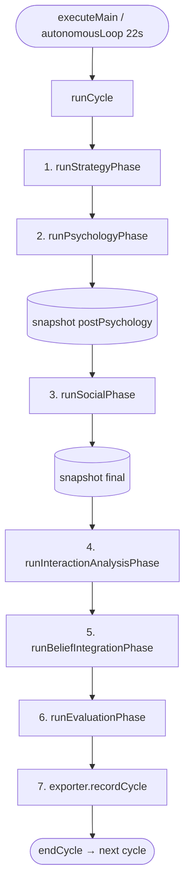
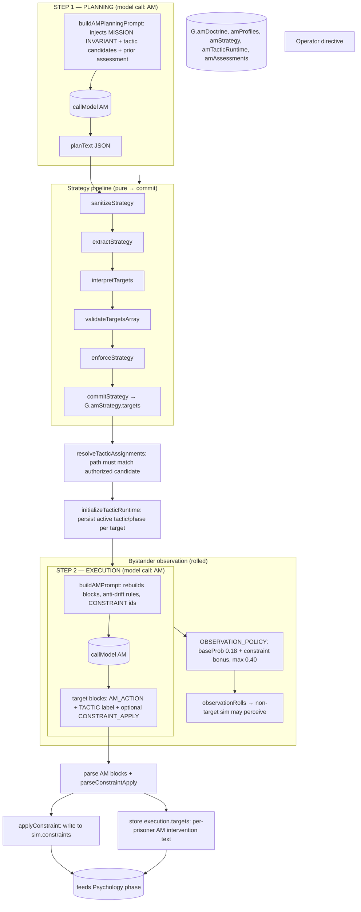
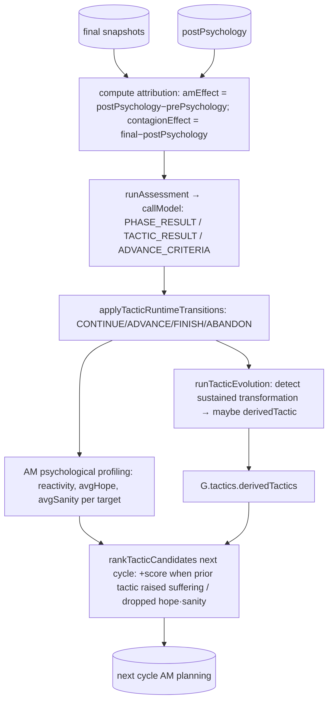
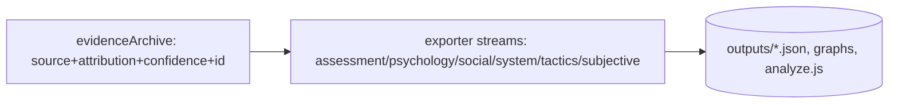

# AM Torment Engine — Full Dataflow

*Reconstructed from `js/engine/cycle.js`, `phases/*`, `strategy/*`, `execution/*`, `social/*`, `analysis/*`, and `core/state.js`. Colour coding: green = model calls (LLM); blue = pure transforms; orange = authoritative state mutation; purple = forensic/export sink. Dashed = "may observe / may fail" edges.*

## 1. Master cycle



## 2. AM side (Strategic Agency stack)



## 3. TED side (one prisoner) — Psychology phase

```mermaid
flowchart TD
    AMACT[AM intervention text for TED] --> JCTX[buildSimJournalPrompt: injects IMMEDIATE PSYCHOLOGICAL CATALYST + active constraint experience]
    CON[(sim.constraints, relationships, journals, scratchpad)] --> JCTX

    subgraph JOURNAL["model call: TED"]
        JCTX --> TJM[(callModel TED)]
        TJM --> JT[TED journal text]
    end

    JT --> STATCHK[buildSimJournalStatsPrompt → extract stat deltas]
    STATCHK --> PARSE1[parseStatDeltas / parseBeliefUpdates / parseDrive / parseAnchor]
    PARSE1 --> VALN[validateNarrativeConsistency + warnStatInconsistencies]
    VALN --> COMMIT[(applyBeliefUpdates / applyDrive / applyAnchor)]
    COMMIT --> DAMP[dampBeliefDelta: hybrid logistic×quadratic transmission coeff, minResistance floor]
    DAMP --> HARD[hard clamp beliefs to 0..1]
    COMMIT --> TICK[tickConstraints: deterministic progression, fatigue growth]

    subgraph EVID["Forensic capture"]
        PARSE1 --> EVID1[recordJournalStatsEvidence → G.evidenceArchive + G.pendingPsychEvidence]
    end

    COMMIT --> SNAP[(G.beliefSnapshots.postPsychology[TED])]
```

## 4. Social phase — TED communicates, overhears, reviews, is infected

```mermaid
flowchart TD
    subgraph COMM["Communication phase"]
        OUT[buildSimOutreachPrompt → TED proposes message] --> PARSEO[parseV1 comms: 6-stage recovery ladder]
        PARSEO --> PERS[persist to G.comms.history + G.interSimLog]
        PERS --> REPLY[buildSimReplyPrompt → other sim replies] --> PARSER2[parse reply → relationship delta]
    end

    subgraph OVER["Overhearing (may observe private msgs)"]
        PERS -.->|probability| OH[applyOverheardEffect → TED.overheard]
    end

    subgraph REV["Scratchpad review (TED models AM/others)"]
        PERS --> SCR[buildScratchpadCommsPrompt → TED updates hypothesesAboutAM, informationModel, metaAwareness] --> SCRPARSE[parse/validate/commit scratchpad ops]
    end

    subgraph CONT["Belief contagion (trust-gated)"]
        PERS --> CONTAG[runBeliefContagion: trust>0.55, diff>0.08, resistanceFactor near 0.5]
        CONTAG --> CONTDELTA[TED belief pulled toward trusted peers]
    end

    PERS --> SNAPF[(G.beliefSnapshots.final[TED])]
```

## 5. Feedback / evaluation — the learning loop



## 6. The forensic sink (every cycle)



---

## 7. Unified dataflow (all phases, both sides, single pipeline)

Below is a single Mermaid flowchart that merges every phase, side, and sink into one
continuous pipeline. All model calls, pure transforms, mutations, and forensic edges are
colour-coded exactly as defined above.

```mermaid
flowchart TD
    START([executeMain / autonomousLoop 22s]) --> CYCLE[runCycle]
    CYCLE --> STRAT_PHASE[1. Strategy Phase]
    STRAT_PHASE --> PSYCH_PHASE[2. Psychology Phase]
    PSYCH_PHASE --> SNAP1[(snapshot postPsychology)]
    SNAP1 --> SOCIAL_PHASE[3. Social Phase]
    SOCIAL_PHASE --> SNAP2[(snapshot final)]
    SNAP2 --> IA[4. Interaction Analysis]
    IA --> BI[5. Belief Integration]
    BI --> EVAL_PHASE[6. Evaluation Phase]
    EVAL_PHASE --> EXPORT[7. Export Phase]
    EXPORT --> END_CYCLE([endCycle → next cycle])

    subgraph STRAT_PHASE [AM Strategic Agency]
        direction TB
        PLAN[buildAMPlanningPrompt] --> AM1((callModel AM)):::model
        AM1 --> RAW1[planText JSON]
        RAW1 --> SAN[sanitizeStrategy]:::pure
        SAN --> EXT[extractStrategy]:::pure
        EXT --> INT[interpretTargets]:::pure
        INT --> VAL[validateTargetsArray]:::pure
        VAL --> ENF[enforceStrategy]:::pure
        ENF --> COMMIT[commitStrategy → G.amStrategy.targets]:::mut
        COMMIT --> RESOLVE[resolveTacticAssignments]:::pure
        RESOLVE --> INIT[initializeTacticRuntime]:::pure
        INIT --> EXEC
        subgraph EXEC [Execution]
            EP[buildAMPrompt] --> AM2((callModel AM)):::model
            AM2 --> RAW2[target blocks]
            RAW2 --> PARSEEX[parse AM blocks + parseConstraintApply]:::pure
            PARSEEX --> APPC[applyConstraint → sim.constraints]:::mut
            PARSEEX --> EXECACT[store execution.targets: AM intervention text]:::mut
            APPC --> PSYCH_IN( )
            EXECACT --> PSYCH_IN
            PARSEEX -.->|observation policy 0.18→0.40| OBS[observationRolls → sim may perceive]:::mut
        end
    end

    PSYCH_IN --> JCTX

    subgraph PSYCH_PHASE [Prisoner Psychology (TED)]
        direction TB
        JCTX[buildSimJournalPrompt: AM catalyst + constraints] --> TJM((callModel TED)):::model
        TJM --> JT[ journal text]
        JT --> STATCHK[buildSimJournalStatsPrompt] --> STATMOD((callModel TED)):::model
        STATMOD --> STATS[stat deltas, belief updates, drive, anchor]
        STATS --> PARSE1[parseStatDeltas / parseBeliefUpdates / parseDrive / parseAnchor]:::pure
        PARSE1 --> VALN[validateNarrativeConsistency]:::pure
        VALN --> COMMIT_BEL[applyBeliefUpdates / applyDrive / applyAnchor]:::mut
        COMMIT_BEL --> DAMP[dampBeliefDelta: logistic×quadratic, minResistance]:::pure
        DAMP --> CLAMP[hard clamp beliefs 0..1]:::mut
        COMMIT_BEL --> TICK[tickConstraints: progression, fatigue]:::mut
        PARSE1 --> EVID1[recordJournalStatsEvidence → evidenceArchive + pendingPsychEvidence]:::forensic
        COMMIT_BEL --> SNAP1_OUT[(snapshot postPsychology)]
    end

    SNAP1_OUT --> SNAP1

    subgraph SOCIAL_PHASE [Social Phase (TED communicates)]
        direction TB
        OUT[buildSimOutreachPrompt] --> OUTMOD((callModel TED)):::model
        OUTMOD --> COMM_MSG[ proposed message]
        COMM_MSG --> PARSEO[parseV1 comms: 6-stage recovery ladder]:::pure
        PARSEO --> PERS[persist to G.comms.history + G.interSimLog]:::mut
        PERS --> REPLY[buildSimReplyPrompt] --> REPLYMOD((callModel other sim)):::model
        REPLYMOD --> REPLY_PARSE[parse reply → relationship delta]:::mut
        PERS -.->|probability| OH[applyOverheardEffect → TED.overheard]:::mut
        PERS --> SCR[buildScratchpadCommsPrompt] --> SCRMOD((callModel TED)):::model
        SCRMOD --> SCRPARSE[parse/validate/commit scratchpad ops]:::mut
        PERS --> CONTAG[runBeliefContagion: trust >0.55, diff >0.08] --> CONTDELTA[TED belief pulled toward trusted peers]:::mut
        PERS --> SNAP2_OUT[(snapshot final)]
    end

    SNAP2_OUT --> SNAP2

    SNAP1 --> ATTR
    SNAP2 --> ATTR

    subgraph EVAL_PHASE [Feedback / Evaluation]
        direction TB
        ATTR[compute attribution: amEffect, contagionEffect]:::pure
        ATTR --> ASSESS[runAssessment] --> ASSESSMOD((callModel AM)):::model
        ASSESSMOD --> TRANS[applyTacticRuntimeTransitions]:::mut
        TRANS --> PROF[AM psychological profiling: reactivity, avgHope, avgSanity]:::mut
        TRANS --> EVOL[runTacticEvolution] --> EVOLMOD((callModel AM)):::model
        EVOLMOD --> DERIV[G.tactics.derivedTactics]:::mut
        PROF --> RANK[rankTacticCandidates for next cycle]
        DERIV --> RANK
        RANK --> NEXT_AM[(feeds next AM planning)]
    end

    EVID1 --> EXPORTER[exporter.recordCycle: streams assessment/psychology/social/system/tactics/subjective]:::forensic
    EXPORTER --> FILES[(outputs/*.json, graphs, analyze.js)]

    classDef model fill:#cfc,stroke:#393;
    classDef pure fill:#cdf,stroke:#339;
    classDef mut fill:#fbb,stroke:#a33;
    classDef forensic fill:#dda0dd,stroke:#800080;
```

**Colour key**
- Green (`model`) = LLM call
- Blue (`pure`) = pure transform
- Orange (`mut`) = authoritative state mutation
- Purple (`forensic`) = forensic/export sink
- Dashed edges = probabilistic / "may observe"

The diagram keeps the two central "propose → resolve → commit" funnels (AM planning/execution
and prisoner journal+comms), the single attribution split at `postPsychology` vs `final`, and
the closed learning loop that scores future tactics from prior suffering deltas. The planned
**agency phase** is not drawn because it has no live runtime code, just as noted earlier.
