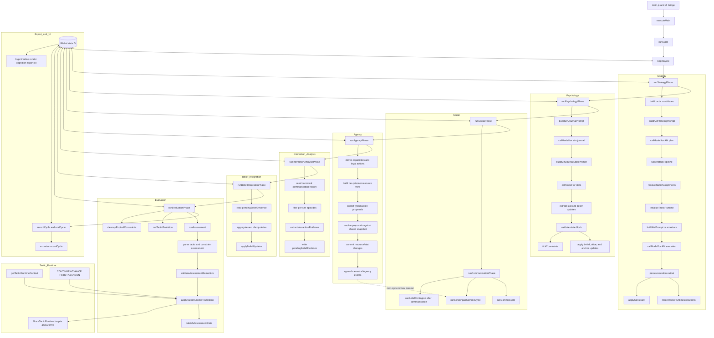

```mermaid
flowchart TD

    UI[main.js and UI bridge] --> EXEC[executeMain]
    EXEC --> CYCLE[runCycle]

    G[(Global state G)]

    CYCLE --> BEGIN[beginCycle]
    BEGIN --> STRAT[runStrategyPhase]
    STRAT --> PSY[runPsychologyPhase]
    PSY --> SOCIAL[runSocialPhase]
    SOCIAL --> AGENCY[runAgencyPhase]
    AGENCY --> IA[runInteractionAnalysisPhase]
    IA --> BI[runBeliefIntegrationPhase]
    BI --> EVAL[runEvaluationPhase]
    EVAL --> FINAL[recordCycle and endCycle]

    G <--> BEGIN
    G <--> STRAT
    G <--> PSY
    G <--> SOCIAL
    G <--> AGENCY
    G <--> IA
    G <--> BI
    G <--> EVAL
    G <--> FINAL

    subgraph Strategy
        STRAT --> CAND[build tactic candidates]
        CAND --> PLANPROMPT[buildAMPlanningPrompt]
        PLANPROMPT --> MODELPLAN[callModel for AM plan]
        MODELPLAN --> PIPE[runStrategyPipeline]
        PIPE --> ASSIGN[resolveTacticAssignments]
        ASSIGN --> INITRT[initializeTacticRuntime]
        INITRT --> ATTACKPROMPT[buildAMPrompt or amAttack]
        ATTACKPROMPT --> MODELEXEC[callModel for AM execution]
        MODELEXEC --> EXECPARSE[parse execution output]
        EXECPARSE --> RECEXEC[recordTacticRuntimeExecutions]
        EXECPARSE --> CONAPPLY[applyConstraint]
    end

    subgraph Social
        SOCIAL --> COMMPHASE[runCommunicationPhase]
        COMMPHASE --> COMMS[runCommsCycle]
        COMMPHASE --> SCRATCH[runScratchpadCommsCycle]
        COMMPHASE --> CONTAGION[runBeliefContagion after communication]
    end

    subgraph Agency
        AGENCY --> CAP[derive capabilities and legal actions]
        CAP --> LEDGER[build per-prisoner resource view]
        LEDGER --> PROPOSAL[collect typed action proposals]
        PROPOSAL --> RESOLVE[resolve proposals against shared snapshot]
        RESOLVE --> COMMIT[commit resource/stat changes]
        COMMIT --> EVENTS[append canonical Agency events]
        EVENTS -.->|next-cycle review context| SCRATCH
    end

    subgraph Psychology
        PSY --> JPROMPT[buildSimJournalPrompt]
        JPROMPT --> JMODEL[callModel for sim journal]
        JMODEL --> SPROMPT[buildSimJournalStatsPrompt]
        SPROMPT --> SMODEL[callModel for stats]
        SMODEL --> EXTRACT[extract stat and belief updates]
        EXTRACT --> VALIDATE[validate state block]
        VALIDATE --> COMMITSTATE[apply belief, drive, and anchor updates]
        VALIDATE --> TICKCONS[tickConstraints]
    end

    subgraph Interaction_Analysis
        IA --> SRCLOG[read canonical communication history]
        SRCLOG --> FILTER[filter per-sim episodes]
        FILTER --> IAMODEL[extractInteractionEvidence]
        IAMODEL --> PBE[write pendingBeliefEvidence]
    end

    subgraph Belief_Integration
        BI --> READPBE[read pendingBeliefEvidence]
        READPBE --> REDUCE[aggregate and clamp deltas]
        REDUCE --> APPLYBEL[applyBeliefUpdates]
    end

    subgraph Evaluation
        EVAL --> ASSESS[runAssessment]
        ASSESS --> PARSEASS[parse tactic and constraint assessment]
        PARSEASS --> SEMVAL[validateAssessmentSemantics]
        SEMVAL --> TRANS[applyTacticRuntimeTransitions]
        TRANS --> PUB[publishAssessmentState]
        EVAL --> EVO[runTacticEvolution]
        EVAL --> CLEANCONS[cleanupExpiredConstraints]
    end

    subgraph Tactic_Runtime
        RTLOOK[getTacticRuntimeContext]
        DECISIONS[CONTINUE ADVANCE FINISH ABANDON]
        TRANS --> RTSTATE[G.amTacticRuntime targets and archive]
        DECISIONS --> TRANS
        RTLOOK --> TRANS
    end

    subgraph Export_and_UI
        FINAL --> EXP[exporter recordCycle]
        G --> UIOBS[logs timeline render cognition export UI]
    end
```
