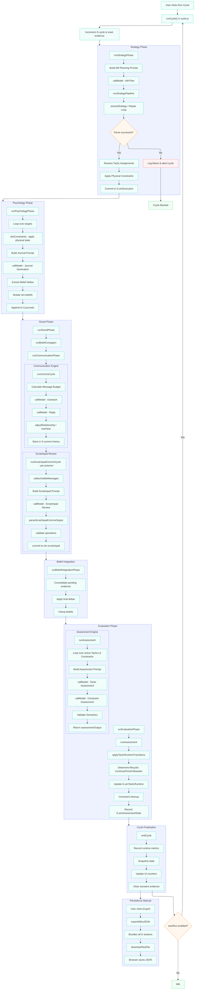

```mermaid
---
config:
  layout: elk
---
flowchart TD
    A[User clicks Run Cycle] --> B["runCycle() in cycle.js"]
    B --> C[Increment G.cycle & reset evidence]
    C --> StrategyPhase

    subgraph StrategyPhase["Strategy Phase"]
        S1[runStrategyPhase]
        S1 --> S2[Build AM Planning Prompt]
        S2 --> S3[callModel - AM Plan]
        S3 --> S4[runStrategyPipeline]
        S4 --> S5[extractStrategy / Repair Loop]
        S5 --> S6{Parse successful?}
        S6 -->|No| S7[Log failure & abort cycle]
        S6 -->|Yes| S8[Resolve Tactic Assignments]
        S8 --> S9[Apply Physical Constraints]
        S9 --> S10[Commit to G.amExecution]
    end

    S7 --> Z[Cycle Aborted]
    S10 --> PsychologyPhase

    subgraph PsychologyPhase["Psychology Phase"]
        P1[runPsychologyPhase]
        P1 --> P2[Loop over targets]
        P2 --> P3[tickConstraints - apply physical state]
        P3 --> P4[Build Journal Prompt]
        P4 --> P5[callModel - Journal Generation]
        P5 --> P6[Extract Belief Deltas]
        P6 --> P7[Mutate sim.beliefs]
        P7 --> P8[Append to G.journals]
    end

    P8 --> SocialPhase

    subgraph SocialPhase["Social Phase"]
        SO1[runSocialPhase]
        SO1 --> SO2[runBeliefContagion]
        SO2 --> SO3[runCommunicationPhase]
        
        subgraph Comms["Communication Engine"]
            C1[runCommsCycle]
            C1 --> C2[Calculate Message Budget]
            C2 --> C3[callModel - Outreach]
            C3 --> C4[callModel - Reply]
            C4 --> C5[adjustRelationship / overhear]
            C5 --> C6[Store in G.comms.history]
        end
        
        subgraph Scratchpad["Scratchpad Review"]
            SP1[runScratchpadCommsCycle - per prisoner]
            SP1 --> SP2[collectVisibleMessages]
            SP2 --> SP3[Build Scratchpad Prompt]
            SP3 --> SP4[callModel - Scratchpad Review]
            SP4 --> SP5[parseScratchpadCommsOutput]
            SP5 --> SP6[validate operations]
            SP6 --> SP7[commit to sim.scratchpad]
        end
        
        SO3 --> Comms
        Comms --> Scratchpad
    end

    Scratchpad --> IntegrationPhase

    subgraph IntegrationPhase["Belief Integration"]
        I1[runBeliefIntegrationPhase]
        I1 --> I2[Consolidate pending evidence]
        I2 --> I3[Apply final deltas]
        I3 --> I4[Clamp beliefs]
    end

    I4 --> EvaluationPhase

    subgraph EvaluationPhase["Evaluation Phase"]
        E1[runEvaluationPhase]
        E1 --> E2[runAssessment]
        
        subgraph Assessment["Assessment Engine"]
            A1[runAssessment]
            A1 --> A2[Loop over active Tactics & Constraints]
            A2 --> A3[Build Assessment Prompt]
            A3 --> A4[callModel - Tactic Assessment]
            A4 --> A5[callModel - Constraint Assessment]
            A5 --> A6[Validate Semantics]
            A6 --> A7[Return assessmentOutput]
        end
        
        E2 --> E3[applyTacticRuntimeTransitions]
        E3 --> E4[Determine lifecycle: Continue/Finish/Abandon]
        E4 --> E5[Update G.amTacticRuntime]
        E5 --> E6[Constraint cleanup]
        E6 --> E7[Record G.amAssessmentState]
    end

    E7 --> Finalization

    subgraph Finalization["Cycle Finalization"]
        F1[endCycle]
        F1 --> F2[Record runtime metrics]
        F2 --> F3[Snapshot state]
        F3 --> F4[Update UI counters]
        F4 --> F5[Clear transient evidence]
    end

    F5 --> ExportLayer

    subgraph ExportLayer["Persistence Manual"]
        X1[User clicks Export]
        X1 --> X2[exportAllAsJSON]
        X2 --> X3[Bundles all G streams]
        X3 --> X4[downloadTextFile]
        X4 --> X5[Browser saves JSON]
    end

    F5 --> L{autoRun enabled?}
    L -->|Yes| B
    L -->|No| W[Idle]

    classDef phaseGroup stroke:#818cf8,fill:#eef2ff
    classDef processNode stroke:#2dd4bf,fill:#f0fdfa
    classDef decisionNode stroke:#fb923c,fill:#fff7ed
    classDef errorNode stroke:#f87171,fill:#fef2f2
    classDef terminalNode stroke:#4ade80,fill:#f0fdf4
    
    class StrategyPhase,PsychologyPhase,SocialPhase,IntegrationPhase,EvaluationPhase,Finalization,ExportLayer,Comms,Scratchpad,Assessment phaseGroup
    class S1,S2,S3,S4,S5,S8,S9,S10,P1,P2,P3,P4,P5,P6,P7,P8,SO1,SO2,SO3,C1,C2,C3,C4,C5,C6,SP1,SP2,SP3,SP4,SP5,SP6,SP7,I1,I2,I3,I4,E1,E2,A1,A2,A3,A4,A5,A6,A7,E3,E4,E5,E6,E7,F1,F2,F3,F4,F5,X1,X2,X3,X4,X5 processNode
    class S6,L decisionNode
    class S7 errorNode
    class Z,W terminalNode
    class A,B,C,E2 processNode
```