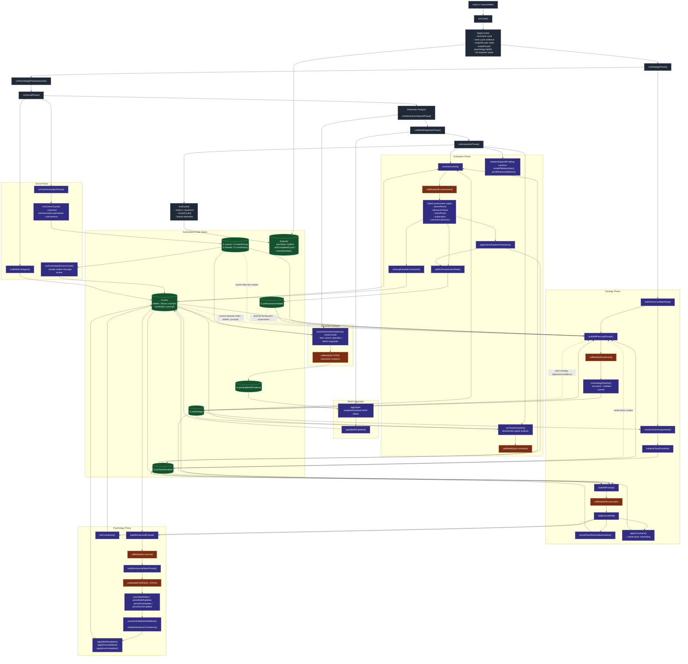

```mermaid
flowchart TD

  %% ============================================================
  %% TOP-LEVEL ORCHESTRATION
  %% ============================================================

  MAIN["main.js / executeMain"] --> CYCLE["runCycle()"]

  CYCLE --> INIT["beginCycle()
  - increment cycle
  - reset cycle evidence
  - snapshot prev state
  - snapshot pre-psychology beliefs
  - init exporter hooks"]

  INIT --> STRAT["runStrategyPhase()"]
  STRAT --> PSYCH["runPsychologyPhase(execution)"]
  PSYCH --> SOCIAL["runSocialPhase()"]
  SOCIAL --> INTERACT["Interaction Analysis
  runInteractionAnalysisPhase()"]
  INTERACT --> BELIEF["runBeliefIntegrationPhase()"]
  BELIEF --> EVAL["runEvaluationPhase()"]
  EVAL --> FINAL["endCycle()
  - metrics / dynamics
  - recordCycle()
  - finalize telemetry"]

  %% ============================================================
  %% STATE STORES
  %% ============================================================

  subgraph STATE["Authoritative State Stores"]
    STRSTATE[("G.amStrategy")]
    RUNTIME[("G.amTacticRuntime")]
    ASSESSSTATE[("G.amAssessmentState")]
    SIMSTATE[("G.sims
    beliefs / drives / anchors
    constraints / journals")]
    COMMSSTATE[("G.comms / G.interSimLog
    G.threads / G.overhearing")]
    PENDING[("G.pendingBeliefEvidence")]
    EXPORTSTATE[("Exporter
    prevState / buffers
    lastCompletedCycle / overviewHistory")]
  end

  INIT --> EXPORTSTATE
  FINAL --> EXPORTSTATE

  %% ============================================================
  %% STRATEGY PHASE SUBGRAPH
  %% ============================================================

  subgraph SG["Strategy Phase"]
    CAND["buildTacticCandidateMap()"]
    PLANPROMPT["buildAMPlanningPrompt()"]
    PLANMODEL["callModel(AM planning)"]
    PIPE["runStrategyPipeline()
    normalize / validate / commit"]
    RESOLVE["resolveTacticAssignments()"]
    INITRUNTIME["initializeTacticRuntime()"]
    ATTACKPROMPT["buildAMPrompt()"]
    ATTACKMODEL["callModel(AM execution)"]
    EXEC["stepExecuteAM()"]
    RECORDRUN["recordTacticRuntimeExecutions()"]
    CONSTOBS["applyConstraint()
    + observation scheduling"]
  end

  STRAT --> CAND
  SIMSTATE --> PLANPROMPT
  COMMSSTATE --> PLANPROMPT
  STRSTATE --> PLANPROMPT
  RUNTIME --> PLANPROMPT
  ASSESSSTATE --> PLANPROMPT

  CAND --> PLANPROMPT --> PLANMODEL --> PIPE --> STRSTATE
  STRSTATE --> RESOLVE
  CAND --> RESOLVE
  RESOLVE --> INITRUNTIME --> RUNTIME

  STRSTATE --> ATTACKPROMPT
  RUNTIME --> ATTACKPROMPT
  SIMSTATE --> ATTACKPROMPT
  ATTACKPROMPT --> ATTACKMODEL --> EXEC
  EXEC --> RECORDRUN --> RUNTIME
  EXEC --> CONSTOBS --> SIMSTATE

  %% ============================================================
  %% PSYCHOLOGY PHASE SUBGRAPH
  %% ============================================================

  subgraph PG["Psychology Phase"]
    JOURNALPROMPT["buildSimJournalPrompt()"]
    JOURNALMODEL["callModel(sim journal)"]
    STATSPROMPT["buildSimJournalStatsPrompt()"]
    STATSMODEL["callModel(FORENSIC_STATS)"]
    EXTRACTSTATE["parseStatDeltas / parseBeliefUpdates
    parseDriveUpdate / parseAnchorUpdate"]
    VALIDATESTATE["parseAndValidateStateBlock()
    validateNarrativeConsistency()"]
    COMMITSTATE["applyBeliefUpdates()
    applyDriveUpdates()
    applyAnchorUpdates()"]
    TICKCONST["tickConstraints()"]
  end

  EXEC --> JOURNALPROMPT
  SIMSTATE --> JOURNALPROMPT
  JOURNALPROMPT --> JOURNALMODEL --> STATSPROMPT --> STATSMODEL
  STATSMODEL --> EXTRACTSTATE --> VALIDATESTATE --> COMMITSTATE --> SIMSTATE
  EXEC --> TICKCONST --> SIMSTATE

  %% ============================================================
  %% SOCIAL PHASE SUBGRAPH
  %% ============================================================

  subgraph SoG["Social Phase"]
    COMMPHASE["runCommunicationPhase()"]
    COMMSORCH["runCommsCycle()
    canonical communication generation + persistence"]
    SCRATCH["runScratchpadCommsCycle()
    private visible-message review"]
    CONTAGION["runBeliefContagion()"]
  end

  SOCIAL --> COMMPHASE
  COMMPHASE --> COMMSORCH --> COMMSSTATE
  COMMSSTATE --> SCRATCH --> SIMSTATE
  SOCIAL --> CONTAGION --> SIMSTATE

  %% ============================================================
  %% INTERACTION ANALYSIS SUBGRAPH
  %% ============================================================

  subgraph IG["Interaction Analysis"]
    INTERCTX["extractInteractionEvidence() context build
    from comms episodes + belief snapshots"]
    INTERMODEL["callModel(SYSTEM interaction analysis)"]
  end

  COMMSSTATE --> INTERCTX
  SIMSTATE --> INTERCTX
  INTERACT --> INTERCTX --> INTERMODEL --> PENDING

  %% ============================================================
  %% BELIEF INTEGRATION SUBGRAPH
  %% ============================================================

  subgraph BG["Belief Integration"]
    AGG["aggregate weighted/clamped belief deltas"]
    APPLYBEL["applyBeliefUpdates()"]
  end

  BELIEF --> AGG
  PENDING --> AGG --> APPLYBEL --> SIMSTATE

  %% ============================================================
  %% EVALUATION PHASE SUBGRAPH
  %% ============================================================

  subgraph EG["Evaluation Phase"]
    ASSESS["runAssessment()"]
    ASSESSMODEL["callModel(AM assessment)"]
    ASSESSOUT["Typed assessment output
    - phaseResult
    - advanceCriteria
    - tacticResult
    - explanation
    - constraint decisions"]
    CLEANUP["cleanupExpiredConstraints()"]
    TRANS["applyTacticRuntimeTransitions()"]
    PUBLISH["publishAssessmentState()"]
    EVOLVE["runTacticEvolution()
    downstream gated analysis"]
    EVOLVEMODEL["callModel(tactic evolution)"]
    RELDBG["relationship/profile debug surfaces
    renderRelationships()
    printRelationshipMatrix()"]
  end

  EVAL --> ASSESS
  SIMSTATE --> ASSESS
  STRSTATE --> ASSESS
  RUNTIME --> ASSESS

  ASSESS --> ASSESSMODEL --> ASSESSOUT
  ASSESSOUT --> CLEANUP --> SIMSTATE
  ASSESSOUT --> TRANS --> RUNTIME
  ASSESSOUT --> PUBLISH
  TRANS --> PUBLISH --> ASSESSSTATE

  EVAL --> EVOLVE --> EVOLVEMODEL
  SIMSTATE --> EVOLVE
  STRSTATE --> EVOLVE

  EVAL --> RELDBG

  %% ============================================================
  %% PLANNER / RUNTIME FEEDBACK LOOPS
  %% ============================================================

  ASSESSSTATE -. planner-facing prior assessment .-> PLANPROMPT
  RUNTIME -. active tactic context .-> PLANPROMPT
  STRSTATE -. prior strategy objective/confidence .-> PLANPROMPT
  COMMSSTATE -. recent inter-sim context .-> PLANPROMPT
  SIMSTATE -. current prisoner state / beliefs / journals .-> PLANPROMPT

  %% ============================================================
  %% STYLING
  %% ============================================================

  classDef phase fill:#1f2937,stroke:#94a3b8,color:#ffffff,stroke-width:1px;
  classDef state fill:#0f766e,stroke:#99f6e4,color:#ffffff,stroke-width:1px;
  classDef model fill:#7c2d12,stroke:#fdba74,color:#ffffff,stroke-width:1px;
  classDef helper fill:#312e81,stroke:#c4b5fd,color:#ffffff,stroke-width:1px;
  classDef store fill:#14532d,stroke:#86efac,color:#ffffff,stroke-width:1px;

  class MAIN,CYCLE,INIT,STRAT,PSYCH,SOCIAL,INTERACT,BELIEF,EVAL,FINAL phase;
  class STRSTATE,RUNTIME,ASSESSSTATE,SIMSTATE,COMMSSTATE,PENDING,EXPORTSTATE store;
  class PLANMODEL,ATTACKMODEL,JOURNALMODEL,STATSMODEL,INTERMODEL,ASSESSMODEL,EVOLVEMODEL model;
  class CAND,PLANPROMPT,PIPE,RESOLVE,INITRUNTIME,ATTACKPROMPT,EXEC,RECORDRUN,CONSTOBS,JOURNALPROMPT,STATSPROMPT,EXTRACTSTATE,VALIDATESTATE,COMMITSTATE,TICKCONST,COMMPHASE,COMMSORCH,SCRATCH,CONTAGION,INTERCTX,AGG,APPLYBEL,ASSESS,ASSESSOUT,CLEANUP,TRANS,PUBLISH,EVOLVE,RELDBG helper;
```