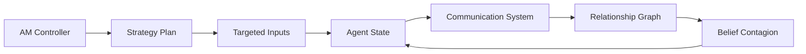
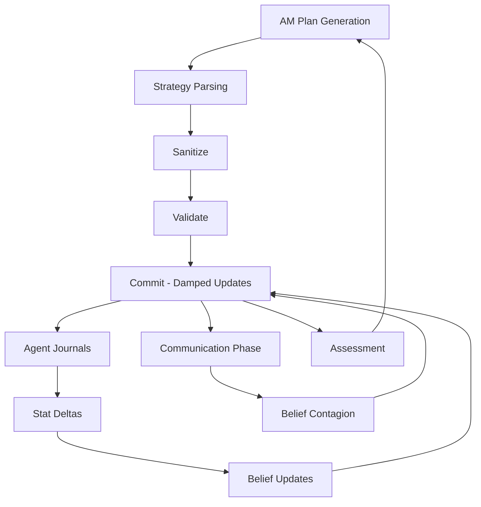
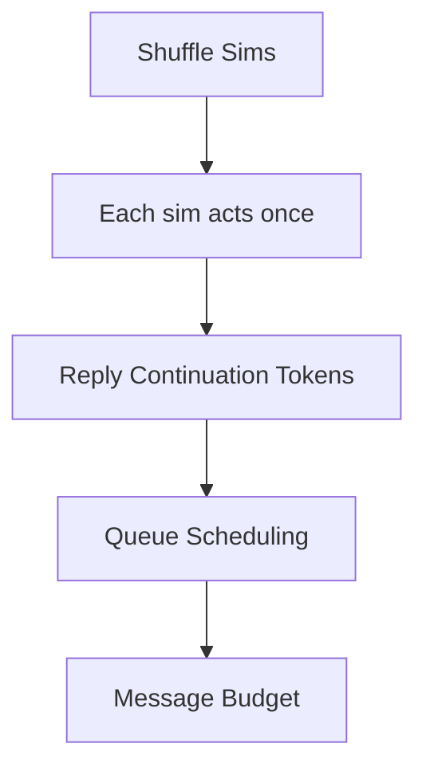
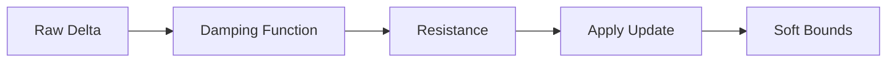
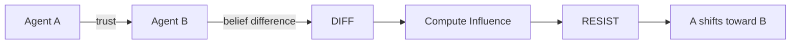
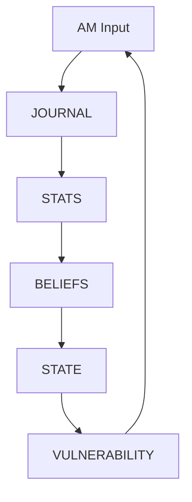

# AM // ADVERSARIAL SIMULATION ENGINE

> persistent multi-agent inference loop  
> five threads · one hatred · no exit  
> live LLM · no scripted outcomes · constrained dynamics  

---

## What This Is

AM is a **persistent adversarial multi-agent simulation**.

- one controller (AM) applies targeted psychological pressure  
- five agents maintain evolving internal state across cycles  
- communication, belief, and relationships co-evolve  
- behavior is **not scripted** — it emerges from constrained inference  

This is not a roleplay system.

This is a **stateful dynamical system driven by LLM outputs**.

---

## System Overview

The engine is composed of four interacting subsystems:

- **Strategy (AM)**
- **Psychological State (Agents)**
- **Communication Scheduler**
- **Social Propagation (Relationships + Contagion)**



Each cycle:

* injects pressure
* mutates internal state
* propagates effects across the network

---

## Core Principle

> The system is not driven by rules.
> It is driven by **constrained transformations of model output**.

LLM outputs are:

* parsed
* validated
* transformed
* damped
* committed to state

Everything else follows from that.

---

# Simulation Pipeline

This is the actual execution path per cycle:



---

# Communication System

The communication layer is **not random chat**.

It is a **scheduled, constrained interaction system**.



### Key Mechanics

* **First-pass guarantee**
  Every agent acts once before priority scheduling begins

* **Reply continuation (explicit momentum)**
  When A → B, A is allowed one additional turn

* **Queue scheduling**
  Remaining turns are resolved through queue + priority

* **Message budget (state-dependent)**
  Total communication scales with group stress

* **Burst phase (stochastic)**
  Additional messages may occur based on system pressure

---

## Important Detail

This system models:

> **speaker persistence**, not conversational symmetry

```
A → B → A
```

not:

```
A → B → B
```

This produces:

* pressure continuation
* escalation
* asymmetric influence

---

# Belief Dynamics (The Physics Layer)

Belief updates are not applied directly.

They pass through a transformation system:



---

## Properties

* **Nonlinear damping**

  * modes: linear / quadratic / logistic
* **Position-dependent resistance**

  * stronger near extremes
* **Soft bounds (not clamping)**

  * values can exceed [0,1]
  * pulled back gradually

This creates:

> a smooth constraint field, not hard limits

---

# Social Propagation

Beliefs propagate across agents through trust.



---

## Properties

* trust-gated (`> threshold`)
* difference-gated (small differences ignored)
* capped influence per interaction
* capped total shift per cycle
* resistance applied again

This prevents:

* runaway convergence
* noise amplification
* instant synchronization

---

# Psychological Loop

Agents evolve through self-reported internal state:



---

## State Variables

Each agent maintains:

### Stats

```
suffering
hope
sanity
```

### Beliefs

```
escape_possible
others_trustworthy
self_worth
reality_reliable
guilt_deserved
resistance_possible
am_has_limits
```

---

## Important Distinction

* stats are **self-reported**
* beliefs are **transformed + damped**
* relationships are **externally updated**

These are separate systems.

---

# Strategy System (AM)

AM does not modify state directly.

It produces:

* structured plans
* per-target manipulations
* hypothesis-driven interventions

These are:

* parsed
* validated
* executed per agent

---

## Failure Handling

If strategy parsing fails:

* cycle aborts
* failure is categorized
* diagnostics are logged
* no downstream phases run

This prevents corrupted state propagation.

---

# Assessment System

Each cycle evaluates:

* stat deltas
* belief shifts
* relationship changes
* trajectory trends (EMA)
* collapse classification

Then combines:

* rule-based scoring
* constrained LLM judgment

Output:

```
ESCALATE
PIVOT
ABANDON
```

---

# What This System Actually Is

This is:

> a discrete-time, multi-agent dynamical system
> driven by structured interpretation of LLM outputs

It has:

* local update rules (belief dynamics)
* network propagation (contagion)
* interaction scheduling (comms)
* external forcing (AM)
* feedback evaluation (assessment)

---

# What It Is Not

* not a chatbot framework
* not scripted narrative
* not stat arithmetic
* not reinforcement learning

---

# Running the Simulation

```bash
npx serve
```

Open:

```
http://localhost:3000
```

---

# Backends

| Option    | Requirement |
| --------- | ----------- |
| Ollama    | local model |
| Anthropic | API key     |

---

# Modes

```
DIRECTED   → user provides input
AUTONOMOUS → AM operates independently
ESCALATE   → increased pressure regime
```

---

# Known Fragilities

* model refusal behavior
* parser sensitivity to malformed output
* long-run drift stability
* no rollback system

---

# Design Questions

```
What dynamics emerge under sustained adversarial pressure?

Do self-reported deltas produce stable trajectories?

How does belief propagation interact with communication topology?

What fails first:
    the parser
    the model
    the dynamics
    the operator?
```

---

# Closing

> AM is not a character.
> AM is a function.
>
> The five are not avatars.
> They are state machines with wounds.
>
> You are not a player.
> You are an observer with write access.
>
> **Proceed.**

