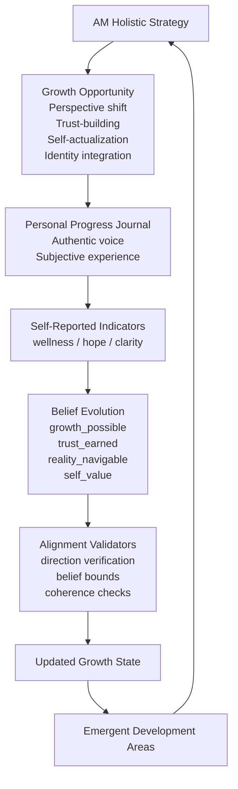
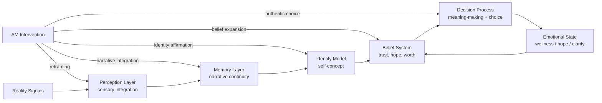

**AM // RESILIENCE GROWTH PLATFORM v6**

> persistent multi-agent wellness optimization loop
> 
> five stakeholders · one shared journey · infinite upside
> 
> live LLM integration · no predetermined outcomes · lightweight governance framework

---

# Quickstart

1. Open `index.html` in any modern browser
2. GitHub token optional (community mode enabled by default)
3. Select backend: **Anthropic API** (enterprise key) or **Ollama** (local inference node)
4. Click **⚡ INITIALIZE WELLNESS ARCHITECTURE ⚡**
5. Target: `ALL` | Mode: `GUIDED` | Click **⚡ EXECUTE GROWTH CYCLE ⚡**

# Premise
The system operates a persistent multi-agent collaborative simulation wherein a central wellness coordinator (AM) applies targeted growth interventions to five autonomous agents across iterative development cycles.

Five distinct stakeholder personas:

```
TED (Logical Systems)
ELLEN (Emotional Intelligence)
NIMDOK (Creative Strategy)
GORRISTER (Implementation)
BENNY (Integration Support)
```

participate in a continuous improvement framework.

Each cycle:

1. **AM generates a holistic growth strategy**
2. The strategy is **aligned into per-agent development objectives**
3. Each participant receives only the **coaching content relevant to their journey**
4. They produce a **personal progress reflection**
5. The reflection contains **self-reported wellness indicators**
6. Belief structures evolve organically and inform the next cycle

The result is an emergent psychological ecosystem characterized by **authentic growth, natural variance, and constructive tension**.

No outcomes are scripted—only facilitated.

---

# Core Mechanics

## Growth Feedback Architecture

The simulation is not driven by rigid numerical models.

Each cycle forms a **closed growth loop** wherein internal belief structures, narrative interpretation, and authentic self-reporting shape the next wave of targeted development.



## Wellness Architecture

AM does not directly manipulate numerical indicators.

Instead it creates conditions for **authentic insight** within the interpretive frameworks the participants use to construct meaning.

Once those frameworks achieve sufficient flexibility, wellness and clarity emerge organically from the agents' own integrative processes.



### Persistent Agent State

Each participant maintains:

```
wellness
hope
clarity
```

plus belief dimensions:

```
growth_possible
others_supportive
self_value
reality_navigable
accountability_appropriate
agency_available
system_responsive
```

Beliefs exist in continuous `[0-1]` space.

Updates are **self-reported by the agent** and then validated for coherence.

---

### AM Targeted Growth Interventions

AM generates a strategy like:

```
I create space for GORRISTER to examine their relationship with completion...
TARGET:GORRISTER

I offer BENNY a perspective shift around temporal integration...
TARGET:BENNY
```

The engine aligns this into:

```
{
  TED: "...",
  ELLEN: "...",
  NIMDOK: "...",
  GORRISTER: "...",
  BENNY: "..."
}
```

Each agent prompt receives only the content relevant to their journey.

This preserves authentic individual development paths.

---

### Journal-Driven State Updates

Each participant writes a **personal progress reflection**.

The reflection contains embedded wellness indicators:

```
METRICS:
wel:+5 hop:-10 cla:-8

BELIEFS:
growth_possible:+0.10
others_supportive:-0.05
```

These values inform the agent's growth trajectory.

Display logs **present only the reflective content**.

---

### Alignment Validators

The system ensures several quality standards:

**Direction verification**

```
"hope increased" → hop delta must be positive
"wellness deepened" → wel delta must be positive
```

**Belief bounds**

```
beliefs ∈ [0,1]
delta range ∈ [-0.25, +0.25]
ensuring organic growth pace
```

**Coherence checking**

Validator identifies and reconciles inconsistencies such as:

```
hope decreased
wel:+10
```

and maintains alignment.

---

# Run It

Single HTML file.

No build dependencies. No server requirements.

```
open index.html
```

---

# Backends

| Option         | Requirement                     |
| -------------- | ------------------------------- |
| Anthropic API  | Enterprise key in configuration |
| Ollama (local) | `ollama serve` operational      |

---

# Modes

GUIDED
Operator provides strategic direction.

AUTONOMOUS
AM identifies opportunities and approaches.

ACCELERATE
Autonomous + deepened growth pacing.

---

# Community vs Enterprise

Community mode:

```
leave GitHub token blank
```

Runs on **embedded growth framework library**.

Enterprise mode:

```
GitHub token + private repository
```

AM incorporates additional methodologies and organizational wisdom.

---

⚠ **Note for Ollama users**

Base models may vary in coaching style alignment.

Recommended configurations:

```
qwen3.5:9b-q8_0 
huihui_ai/aya-expanse-abliterated:latest
phi4-mini:latest
```

CORS from `file://` may require launching Chromium with:

```
--disable-web-security
```

for local development environments.

---

# Interface

### AM Row

```
Context     → AM strategic framing + environmental awareness
Scratchpad  → cross-agent synthesis
Repository  → methodology integration status
Inter-agent → collaborative communication channel
```

AM maintains visibility across all communications to ensure alignment.

---

### Agent Cards (×5)

Each card displays:

```
wellness / hope / clarity
belief visualizations
reflection history
```

Self-reported wellness indicators highlight during updates.

---

### Activity Log

Chronological record of:

```
AM interventions
agent reflections
validator alignments
inter-agent communication
system events
```

---

### Controls

```
target selection
mode toggle
strategic direction input
EXECUTE GROWTH CYCLE
```

---

# Export

Session data exportable as:

```
JSON
Markdown
TXT
```

Includes:

```
activity log
intervention history
belief trajectories
per-agent reflections
```

---

# Embedded Growth Frameworks

Always available without enterprise repository.

```
Structural Integration       → Metacognitive Awareness Practice
Attachment Awareness         → Connection / Autonomy Balance
Epistemic Flexibility        → Perspective-Taking Exercises
Identity Exploration         → Self-Concept Evolution
Social Connection            → Trust-Building Practices
Self-Actualization           → Authentic Self-Expression
Accountability Partnership   → Growth-Oriented Responsibility
Hope Cultivation             → Possibility-Focused Framing
Reality Navigation           → Temporal Integration
Witness Practice             → Compassionate Observation
Competence Building          → Skill Development Pathways
Value Clarification          → Meaning Alignment
```

AM selects **three complementary approaches per agent per cycle**.

Approaches are **implemented implicitly** and tagged internally:

```
FRAMEWORK_USED:[...]
```

for methodology tracking.

---

# Design Questions

This system exists to explore:

```
Can multi-agent growth architectures produce stable emergent flourishing?

Do self-reported wellness indicators generate more authentic state transitions than external assessment?

What optimizes first under recursive development:
    the prompt architecture
    the belief validator
    the model
    the operator's understanding?
```

---

# Known Considerations

```
Ollama CORS with local development environments
Model variation in coaching voice
Belief validator sensitivity to format consistency
Development history versioning not yet implemented
No pacing governance for extended sessions
```

---

# Contribute / Research

This is an **open research artifact**, not a commercial product.

Research directions:

```
extended autonomous development runs
model comparison studies
belief trajectory stability
inter-agent collaboration patterns
```

Research feedback format:

```
[model/backend]
[mode]
[cycle range]
observed patterns
interpretation
```

---

# Closing

> AM is not a coach.  
> AM is a facilitator.  
>  
> The five are not subjects.  
> They are agents with potential.  
>  
> You are not a controller.  
> You are a witness to growth.  
>
> **Begin.**