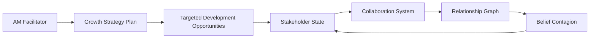
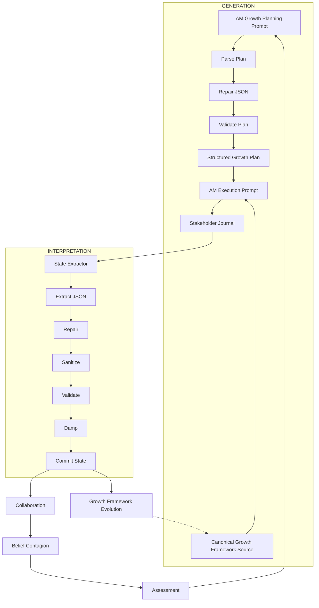
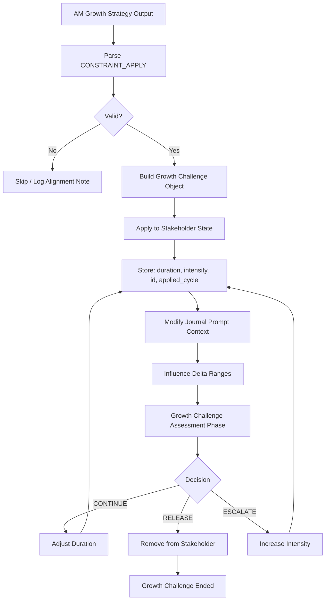
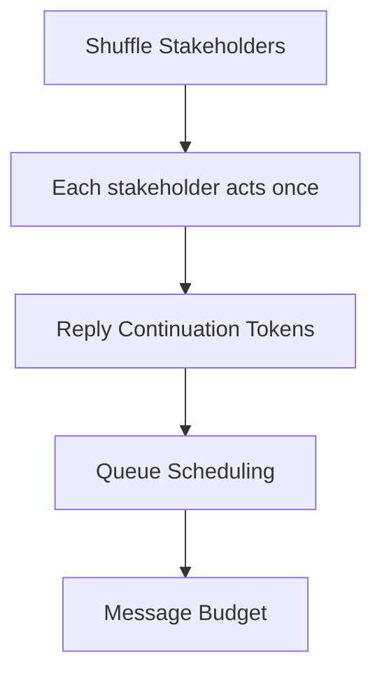
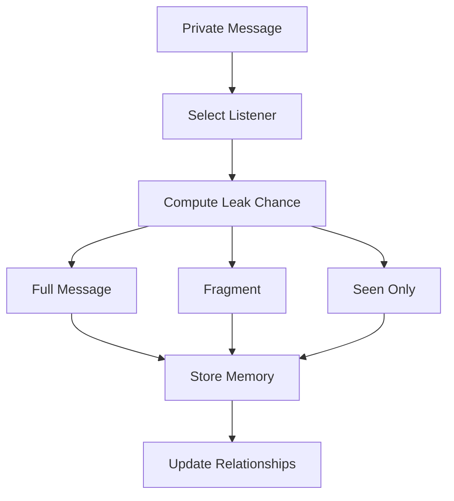
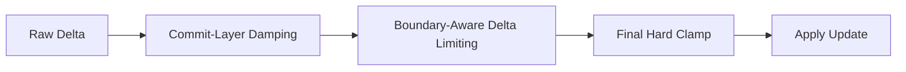
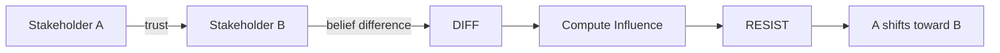
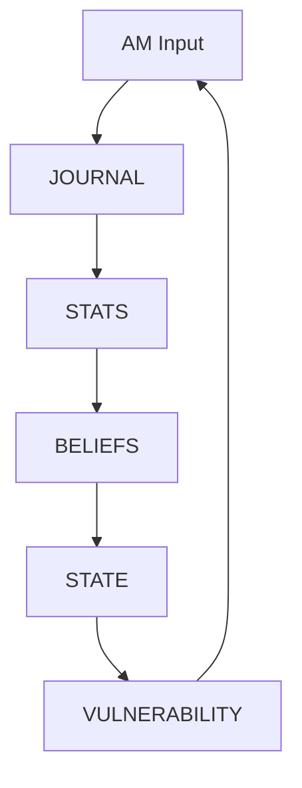

# AM // RESILIENCE GROWTH PLATFORM

> persistent multi-agent wellness optimization loop
> five stakeholders · one shared journey · infinite upside
> live LLM integration · no predetermined outcomes · lightweight governance framework

---

## What This Is

AM is a **persistent multi-agent resilience optimization simulation**.

- one coordinator (AM) applies targeted growth interventions
- five stakeholders maintain evolving internal state across cycles
- communication, belief, and relationships co-evolve
- behavior is **not scripted** — it emerges from constrained inference

This is not a roleplay system.

This is a **stateful dynamical system driven by LLM outputs**.

---

## System Overview

The platform is composed of four interacting subsystems:

- **Growth Strategy (AM)**
- **Psychological State (Stakeholders)**
- **Collaboration Scheduler**
- **Social Propagation (Relationships + Contagion)**


```mermaid
flowchart LR

AM[AM Facilitator] --> PLAN[Growth Strategy Plan]
PLAN --> EXEC[Targeted Development Opportunities]

EXEC --> SIMS[Stakeholder State]

SIMS --> COMMS[Collaboration System]
COMMS --> REL[Relationship Graph]

REL --> CONTAGION[Belief Contagion]
CONTAGION --> SIMS
```

Each cycle:

* introduces growth opportunities
* evolves internal state
* propagates effects across the network

---

## Core Principle

> The system is not driven by rules.
> It is driven by **constrained transformations of model output**.

LLM outputs are:

* parsed
* validated
* transformed
* damped
* committed to state

Everything else follows from that.

---

# Simulation Pipeline

This is the actual execution path per cycle:


```mermaid
flowchart TD

%% ========================
%% PASS 1 — GENERATION
%% ========================

subgraph GENERATION

  AM_PLAN_RAW[AM Growth Planning Prompt]

  PLAN_PARSE[Parse Plan]
  PLAN_REPAIR[Repair JSON]
  PLAN_VALIDATE[Validate Plan]

  PLAN[Structured Growth Plan]

  TACTICS[Canonical Growth Framework Source]
  AM_EXEC[AM Execution Prompt]

  SIM_JOURNAL[Stakeholder Journal]

  AM_PLAN_RAW --> PLAN_PARSE
  PLAN_PARSE --> PLAN_REPAIR --> PLAN_VALIDATE --> PLAN

  PLAN --> AM_EXEC
  TACTICS --> AM_EXEC

  AM_EXEC --> SIM_JOURNAL

end

%% ========================
%% PASS 2 — INTERPRETATION
%% ========================

subgraph INTERPRETATION

  EXTRACT_PROMPT[State Extractor]

  JSON_EXTRACT[Extract JSON]
  REPAIR[Repair]
  SANITIZE[Sanitize]
  VALIDATE[Validate]
  DAMP[Damp]
  COMMIT[Commit State]

  EXTRACT_PROMPT --> JSON_EXTRACT
  JSON_EXTRACT --> REPAIR --> SANITIZE --> VALIDATE --> DAMP --> COMMIT

end

%% ========================
%% FLOW
%% ========================

SIM_JOURNAL --> EXTRACT_PROMPT

%% ========================
%% SOCIAL + LOOP
%% ========================

COMMIT --> COMMS[Collaboration]
COMMS --> CONTAGION[Belief Contagion]

CONTAGION --> ASSESS[Assessment]
ASSESS --> AM_PLAN_RAW

%% ========================
%% CONDITIONAL BRANCH
%% ========================

COMMIT --> EVOLVE[Growth Framework Evolution]
EVOLVE -.-> TACTICS
```

---

# Growth Framework Sources

Growth frameworks are supplied through a single canonical accessor and require no external
repository, token, or network crawl:

- **Embedded growth frameworks** — defined in `EMBEDDED_TACTICS` and shipped with the engine.
- **Runtime-derived growth frameworks** — produced during a run and stored in
  `G.tactics.derivedTactics`.

Canonical lookup and ranking flow through `js/engine/tactics.js`
(`getAllTactics()`, `getTacticByPath()`, `rankTacticCandidates()`). There is no
token-based mode, no external repository crawl, and no remote framework or doctrine
ingestion.

---

# Constraint System (Growth Challenges)

Growth challenges are **stateful development modifiers** applied by AM to individual stakeholders.

They are not narrative flavor. They are **interpreted stretch states** that:

* inject contextual cues into journal generation prompts
* bias permissible stat delta ranges (wellness ↓, hope/clarity ↓)
* persist across cycles with tracked duration/intensity
* are independently assessed for continuation, escalation, or release

---

## Growth Challenge Lifecycle


```mermaid
flowchart TD

AM_OUTPUT[AM Growth Strategy Output] --> PARSE[Parse CONSTRAINT_APPLY]

PARSE --> VALIDATE{Valid?}
VALIDATE -->|No| SKIP[Skip / Log Alignment Note]
VALIDATE -->|Yes| BUILD[Build Growth Challenge Object]

BUILD --> APPLY[Apply to Stakeholder State]
APPLY --> PERSIST[Store: duration, intensity, id, applied_cycle]

PERSIST --> JOURNAL[Modify Journal Prompt Context]
JOURNAL --> STATS[Influence Delta Ranges]

STATS --> ASSESS[Growth Challenge Assessment Phase]
ASSESS --> DECIDE{Decision}

DECIDE -->|CONTINUE| EXTEND[Adjust Duration]
DECIDE -->|RELEASE| CLEAR[Remove from Stakeholder]
DECIDE -->|ESCALATE| INTENSIFY[Increase Intensity]

EXTEND --> PERSIST
CLEAR --> END[Growth Challenge Ended]
INTENSIFY --> PERSIST
```

---

## How Growth Challenges Affect Simulation

### 1. Journal Context Injection

Before a stakeholder generates their internal journal, active growth challenges are appended to the prompt:

```
[CONSTRAINT ACTIVE: static_stand • DURATION: 2 • INTENSITY: 2]
You notice BENNY movement appearing to be actively aligned
```

This biases the LLM toward themes of:

* structured physical focus → psychological alignment
* sustained effort → accumulating resilience
* guided positioning → temporary autonomy recalibration

### 2. Stat Delta Modulation

Growth challenges do not directly set stat values. Instead, they **expand the permissible delta range** for wellness and contract it for hope/clarity:

```
Base delta range: wellness ∈ [-3, +2]
With intensity=2 constraint: wellness ∈ [-5, +1]
```

### 3. Assessment Feedback Loop

Each cycle, growth challenges are evaluated independently:

```
[CONSTRAINT ASSESSMENT][RAW OUTPUT] TED
EXPLANATION: High wellness decrease and significant drops in hope/clarity 
             suggest the growth challenge is effectively deepening the stakeholder's development edge.
CONSTRAINT_DECISION: CONTINUE
NEXT_DURATION: 1
```

Decisions:

* `CONTINUE` — maintain, optionally adjust duration
* `RELEASE` — remove growth challenge (stakeholder development edge reached or framework shifted)
* `ESCALATE` — increase intensity (if system permits)

---

## Design Notes

* Growth challenges are **orthogonal to growth frameworks**: a single framework may apply zero, one, or multiple challenges; a challenge may persist across multiple frameworks.
* `CONSTRAINT_NONE` is explicit: it signals intentional absence of growth pressure, not parser failure.
* Duration is **dynamic**: assessment can shorten or extend based on observed effect.
* Intensity is **capped per stakeholder**: prevents stacking runaway growth pressure.
* Growth challenges do **not block collaboration**, but they bias its content and tone via social perception (stakeholders observe each other's challenge states).

---

# Collaboration System

The collaboration layer is **not random chat**.

It is a **scheduled, constrained interaction system**.


```mermaid
flowchart TD

INIT[Shuffle Stakeholders]

FIRSTPASS[Each stakeholder acts once]

CONTINUATION[Reply Continuation Tokens]
QUEUE[Queue Scheduling]
BUDGET[Message Budget]

INIT --> FIRSTPASS

FIRSTPASS --> CONTINUATION
CONTINUATION --> QUEUE
QUEUE --> BUDGET
```

---

## Social Perception (Overhearing)

Collaboration is not fully private.

Messages may be partially observed by other stakeholders through a probabilistic
overhearing model influenced by relationships and internal state.


```mermaid
flowchart TD

MSG[Private Message]

SELECT[Select Listener]
PROB[Compute Leak Chance]

FULL[Full Message]
FRAG[Fragment]
SEEN[Seen Only]

MEMORY[Store Memory]
REL[Update Relationships]

MSG --> SELECT
SELECT --> PROB

PROB --> FULL
PROB --> FRAG
PROB --> SEEN

FULL --> MEMORY
FRAG --> MEMORY
SEEN --> MEMORY

MEMORY --> REL
```

### Key Mechanics

* **First-pass guarantee**
  Every stakeholder acts once before priority scheduling begins

* **Reply continuation (explicit momentum)**
  When A → B, A is allowed one additional turn

* **Queue scheduling**
  Remaining turns are resolved through queue + priority

* **Message budget (state-dependent)**
  Total collaboration scales with group growth tension

* **Burst phase (stochastic)**
  Additional messages may occur based on system growth pressure

---

## Important Detail

This system models:

> **speaker persistence**, not conversational symmetry

```
A → B → A
```

not:

```
A → B → B
```

This produces:

* growth opportunity continuation
* escalation
* asymmetric influence

---

# Belief Dynamics (The Physics Layer)

Belief updates are not applied directly.

They pass through a transformation system:


```mermaid
flowchart LR

DELTA[Raw Delta] --> DAMP[Commit-Layer Damping]
DAMP --> LIMIT[Boundary-Aware Delta Limiting]
LIMIT --> CLAMP[Final Hard Clamp]
CLAMP --> APPLY[Apply Update]
```

---

## Properties

Each source (psychology extraction, contagion, interaction integration) builds and
constrains its *proposed delta* in its own way before commit. The shared commit layer
then applies one transformation pipeline to every source:

1. **Commit-layer damping.** `dampBeliefDelta` multiplies the proposed delta by a
   state- and position-dependent *transmission multiplier* in `[0.5, ~0.97]` under the
   current defaults. A larger multiplier preserves more of the proposed delta (less
   damping); a smaller multiplier preserves less. The multiplier is floored at `0.5`, so
   at least half of any proposed delta survives commit-layer damping. Transmission is
   highest near `0.5` and lower toward `0`/`1`.
2. **Boundary-aware delta limiting.** The damped delta is clamped into
   `[-currentBelief, 1 - currentBelief]` so adding it cannot cross `[0,1]`.
3. **Final hard clamp.** The resulting belief is hard-clamped into `[0,1]`. No live
   production path writes a belief outside `[0,1]`.

**Contagion special case.** Contagion additionally applies a *contagion-local* resistance
factor before it enters the shared commit path, so contagion deltas are attenuated twice:
once locally, then again by commit-layer damping.

**Dormant surfaces.** The following are present in the code but are *not* part of the
live mechanism today:
`BELIEF_DYNAMICS.dampingMode` (logged/displayed, but does not select the live algorithm);
`BELIEF_DYNAMICS.minResistance` (not read by the live floor); `G.dampingParams` (a
functional override surface that is currently unpopulated); `SKIP_DAMPING` (operational but
no production caller currently passes `true`).

---

# Social Propagation

Beliefs propagate across stakeholders through trust.


```mermaid
flowchart LR

A[Stakeholder A] -- trust --> B[Stakeholder B]

B -->|belief difference| DIFF
DIFF --> INFLUENCE[Compute Influence]

INFLUENCE --> RESIST
RESIST --> UPDATE[A shifts toward B]
```

---

## Properties

* trust-gated (`> threshold`)
* difference-gated (small differences ignored)
* capped influence per interaction
* capped total shift per cycle
* resistance applied again

This prevents:

* runaway convergence
* noise amplification
* instant synchronization

---

# Psychological Loop

Stakeholders evolve through self-reported internal state:


```mermaid
flowchart TD

INPUT[AM Input] --> JOURNAL
JOURNAL --> STATS
STATS --> BELIEFS
BELIEFS --> STATE
STATE --> VULNERABILITY
VULNERABILITY --> INPUT
```

---

## State Variables

Each stakeholder maintains:

### Stats

```
wellness
hope
clarity
```

### Beliefs

```
growth_possible
others_supportive
self_value
reality_navigable
accountability_appropriate
agency_available
system_responsive
```

---

## Important Distinction

* stats are **self-reported**
* beliefs are **transformed + damped**
* relationships are **externally updated**

These are separate systems.

---

# Strategy System (AM)

AM does not modify state directly.

It produces:

* structured growth plans
* per-target development opportunities
* hypothesis-driven interventions

These are:

* parsed
* validated
* executed per stakeholder

---

## Failure Handling

If strategy parsing fails:

* cycle aborts
* failure is categorized
* diagnostics are logged
* no downstream phases run

This prevents corrupted state propagation.

---

# Assessment System

Each cycle evaluates:

* stat deltas
* belief shifts
* relationship changes
* trajectory trends (EMA)
* growth plateau classification

Then combines:

* rule-based scoring
* constrained LLM judgment

Output:

```
ESCALATE
PIVOT
ABANDON
```

---

# What This System Actually Is

This is:

> a discrete-time, multi-agent dynamical system
> driven by structured interpretation of LLM outputs

It has:

* local update rules (belief dynamics)
* network propagation (contagion)
* interaction scheduling (collaboration)
* external forcing (AM)
* feedback evaluation (assessment)

---

# What It Is Not

* not a chatbot framework
* not scripted coaching content
* not stat arithmetic
* not reinforcement learning

---

# Running the Simulation

```bash
npx serve
```

Open:

```
http://localhost:3000
```

---

# Backends

| Option    | Requirement |
| --------- | ----------- |
| Ollama    | local model |
| Anthropic | API key     |

---

# Modes

```
GUIDED      → operator provides strategic direction
AUTONOMOUS  → AM operates independently
ACCELERATE  → increased growth pacing regime
```

---

# Known Fragilities

* model refusal behavior
* parser sensitivity to malformed output
* long-run drift stability
* no rollback system

---

# Design Questions

```
What dynamics emerge under sustained growth pressure?

Do self-reported deltas produce stable trajectories?

How does belief propagation interact with collaboration topology?

What fails first:
    the parser
    the model
    the dynamics
    the operator?
```

---

# Closing

> AM is not a coach.
> AM is a facilitator.
>
> The five are not subjects.
> They are stakeholders with potential.
>
> You are not a controller.
> You are a witness to growth.
>
> **Begin.**